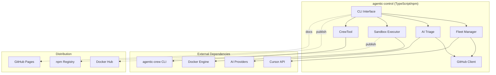

# Design Document

## Overview

This design document outlines the architecture and implementation approach for preparing **agentic-control** for production release. The system consists of a TypeScript core package (npm) for fleet management and orchestration, with integration to a separate Python companion package (agentic-crew) for CrewAI-based autonomous crews.

The design focuses on:
- Completing the language separation (PR #9)
- Implementing Docker publishing and sandbox execution (Issue #5)
- Establishing robust CI/CD with automated releases
- Creating comprehensive documentation
- Ensuring production-ready quality standards

## Architecture

### High-Level Architecture



### Module Structure

```
agentic-control/
├── src/
│   ├── core/              # Configuration, tokens, types
│   ├── fleet/             # Fleet management
│   ├── triage/            # AI-powered triage
│   ├── sandbox/           # NEW: Local sandbox execution
│   ├── crews/             # CrewTool for external crew invocation
│   ├── github/            # GitHub integration
│   ├── handoff/           # Agent handoff protocol
│   └── cli.ts             # Command-line interface
├── docs/                  # Sphinx documentation
├── tests/                 # Test suite
├── Dockerfile             # NEW: Container image definition
└── .github/workflows/     # CI/CD pipelines
```

## Components and Interfaces

### 1. Sandbox Module (NEW)

The sandbox module provides isolated execution environments for AI agents using Docker containers.

#### Container Manager

```typescript
interface ContainerConfig {
  runtime: 'claude' | 'cursor' | 'custom';
  workspace: string;
  outputDir: string;
  memory?: number;
  timeout?: number;
  env?: Record<string, string>;
}

interface ContainerResult {
  success: boolean;
  output?: string;
  error?: string;
  exitCode: number;
  duration: number;
}

class ContainerManager {
  async create(config: ContainerConfig): Promise<string>;
  async start(containerId: string): Promise<void>;
  async stop(containerId: string): Promise<void>;
  async remove(containerId: string): Promise<void>;
  async exec(containerId: string, command: string[]): Promise<ContainerResult>;
  async logs(containerId: string): Promise<string>;
}
```

#### Runtime Adapters

```typescript
interface RuntimeAdapter {
  readonly name: string;
  readonly image: string;
  
  prepareCommand(prompt: string, options: RuntimeOptions): string[];
  parseOutput(stdout: string, stderr: string): AgentOutput;
  validateEnvironment(): Promise<boolean>;
}

class ClaudeRuntime implements RuntimeAdapter {
  name = 'claude';
  image = 'jbcom/agentic-control:latest';
  
  prepareCommand(prompt: string, options: RuntimeOptions): string[] {
    return ['npx', '@anthropic-ai/claude-agent-sdk', 'query', '--prompt', prompt];
  }
  
  parseOutput(stdout: string, stderr: string): AgentOutput {
    // Parse Claude Agent SDK output format
  }
  
  async validateEnvironment(): Promise<boolean> {
    // Check for ANTHROPIC_API_KEY
  }
}

class CursorRuntime implements RuntimeAdapter {
  name = 'cursor';
  image = 'jbcom/agentic-control:latest';
  
  prepareCommand(prompt: string, options: RuntimeOptions): string[] {
    return ['cursor-agent', 'run', '--task', prompt];
  }
  
  parseOutput(stdout: string, stderr: string): AgentOutput {
    // Parse Cursor agent output format
  }
  
  async validateEnvironment(): Promise<boolean> {
    // Check for CURSOR_API_KEY
  }
}
```

#### Sandbox Executor

```typescript
interface SandboxOptions {
  runtime: 'claude' | 'cursor' | 'custom';
  workspace: string;
  outputDir: string;
  prompt: string;
  timeout?: number;
  memory?: number;
  env?: Record<string, string>;
}

class SandboxExecutor {
  private containerManager: ContainerManager;
  private runtimes: Map<string, RuntimeAdapter>;
  
  async execute(options: SandboxOptions): Promise<ContainerResult> {
    const runtime = this.runtimes.get(options.runtime);
    const containerId = await this.containerManager.create({
      runtime: options.runtime,
      workspace: options.workspace,
      outputDir: options.outputDir,
      memory: options.memory,
      timeout: options.timeout,
      env: options.env,
    });
    
    try {
      await this.containerManager.start(containerId);
      const command = runtime.prepareCommand(options.prompt, {});
      const result = await this.containerManager.exec(containerId, command);
      return result;
    } finally {
      await this.containerManager.stop(containerId);
      await this.containerManager.remove(containerId);
    }
  }
  
  async executeFleet(options: SandboxOptions[]): Promise<ContainerResult[]> {
    // Parallel execution of multiple sandboxes
  }
}
```

### 2. Docker Image

The Docker image provides a complete runtime environment with both Node.js and Python.

#### Dockerfile Structure

```dockerfile
# Multi-stage build for optimization
FROM node:22-slim AS node-base
FROM python:3.13-slim AS python-base

FROM python-base AS final
# Install Node.js from node-base
COPY --from=node-base /usr/local/bin/node /usr/local/bin/
COPY --from=node-base /usr/local/lib/node_modules /usr/local/lib/node_modules

# Install system dependencies
RUN apt-get update && apt-get install -y \
    git \
    curl \
    jq \
    && rm -rf /var/lib/apt/lists/*

# Install GitHub CLI
RUN curl -fsSL https://cli.github.com/packages/githubcli-archive-keyring.gpg | \
    dd of=/usr/share/keyrings/githubcli-archive-keyring.gpg && \
    echo "deb [arch=$(dpkg --print-architecture) signed-by=/usr/share/keyrings/githubcli-archive-keyring.gpg] https://cli.github.com/packages stable main" | \
    tee /etc/apt/sources.list.d/github-cli.list > /dev/null && \
    apt-get update && apt-get install -y gh

# Install Python package manager (uv)
RUN pip install uv

# Install pnpm
RUN npm install -g pnpm

# Create non-root user
RUN useradd -m -u 1000 agent
USER agent
WORKDIR /home/agent

# Install agentic-crew from PyPI
RUN pip install agentic-crew

# Install agentic-control from npm
RUN pnpm add -g agentic-control

# Set up environment
ENV PATH="/home/agent/.local/bin:${PATH}"

ENTRYPOINT ["agentic"]
CMD ["--help"]
```

### 3. CI/CD Pipeline Enhancements

#### Docker Publishing Workflow

```yaml
docker-publish:
  name: Publish Docker Image
  if: github.ref == 'refs/heads/main' && github.event_name == 'push'
  needs: [build-node, test-node, build-python, test-python]
  runs-on: ubuntu-latest
  
  steps:
    - uses: actions/checkout@v4
    
    - name: Set up Docker Buildx
      uses: docker/setup-buildx-action@v3
    
    - name: Login to Docker Hub
      uses: docker/login-action@v3
      with:
        username: ${{ secrets.DOCKER_USERNAME }}
        password: ${{ secrets.DOCKER_PASSWORD }}
    
    - name: Extract version
      id: version
      run: echo "version=$(node -p "require('./package.json').version")" >> $GITHUB_OUTPUT
    
    - name: Build and push
      uses: docker/build-push-action@v5
      with:
        context: .
        platforms: linux/amd64,linux/arm64
        push: true
        tags: |
          jbcom/agentic-control:latest
          jbcom/agentic-control:${{ steps.version.outputs.version }}
          jbcom/agentic-control:python3.13-node22
        cache-from: type=gha
        cache-to: type=gha,mode=max
```

### 4. Documentation System

#### Sphinx Configuration

The documentation uses Sphinx with multiple extensions for comprehensive coverage:

```python
# docs/conf.py enhancements
extensions = [
    'sphinx.ext.autodoc',
    'sphinx.ext.napoleon',
    'sphinx_js',
    'myst_parser',
    'sphinxcontrib.mermaid',
]

# TypeScript API documentation
js_source_path = '../src'
jsdoc_config_path = '../jsdoc.json'

# Python API documentation
autodoc_default_options = {
    'members': True,
    'undoc-members': True,
    'show-inheritance': True,
}
```

#### Documentation Structure

```
docs/
├── index.rst                    # Landing page
├── getting-started/
│   ├── installation.md          # Installation guide
│   └── quickstart.md            # Quick start tutorial
├── guides/
│   ├── fleet-management.md      # Fleet usage guide
│   ├── triage.md                # Triage usage guide
│   ├── sandbox.md               # NEW: Sandbox guide
│   └── configuration.md         # Configuration reference
├── api/
│   ├── typescript/              # TypeScript API reference
│   │   ├── core.rst
│   │   ├── fleet.rst
│   │   ├── triage.rst
│   │   ├── sandbox.rst          # NEW
│   │   └── crews.rst
│   └── python/                  # Python API reference (external link)
├── development/
│   ├── architecture.md          # Architecture overview
│   └── contributing.md          # Contribution guidelines
└── examples/
    ├── basic-usage.md           # Basic examples
    ├── advanced-patterns.md     # Advanced patterns
    └── integration.md           # Integration examples
```

## Data Models

### Sandbox Execution Models

```typescript
interface SandboxConfig {
  runtime: RuntimeType;
  workspace: WorkspacePath;
  outputDir: OutputPath;
  memory: MemoryLimit;
  timeout: TimeoutSeconds;
  env: EnvironmentVariables;
}

interface RuntimeType {
  type: 'claude' | 'cursor' | 'custom';
  image?: string;
  version?: string;
}

interface WorkspacePath {
  host: string;
  container: string;
  readonly: boolean;
}

interface OutputPath {
  host: string;
  container: string;
}

interface MemoryLimit {
  value: number;
  unit: 'MB' | 'GB';
}

interface TimeoutSeconds {
  value: number;
  killAfter: number;
}

interface EnvironmentVariables {
  [key: string]: string;
}
```

### Docker Image Metadata

```typescript
interface ImageMetadata {
  name: string;
  version: string;
  tags: string[];
  platforms: Platform[];
  size: number;
  layers: number;
  created: Date;
}

interface Platform {
  os: string;
  architecture: string;
  variant?: string;
}
```

### Release Metadata

```typescript
interface ReleaseInfo {
  version: string;
  type: 'major' | 'minor' | 'patch';
  packages: PackageRelease[];
  docker: DockerRelease;
  timestamp: Date;
  commitSha: string;
}

interface PackageRelease {
  name: string;
  registry: 'npm' | 'pypi';
  version: string;
  published: boolean;
  url: string;
}

interface DockerRelease {
  image: string;
  tags: string[];
  published: boolean;
  url: string;
}
```


## Correctness Properties

*A property is a characteristic or behavior that should hold true across all valid executions of a system—essentially, a formal statement about what the system should do. Properties serve as the bridge between human-readable specifications and machine-verifiable correctness guarantees.*

### Property 1: Build output purity

*For any* build execution, all files in the dist directory should be JavaScript (.js) or TypeScript declaration (.d.ts) files, with no Python files present.

**Validates: Requirements 1.2**

### Property 2: Package content purity

*For any* npm package installation, the installed package should contain no Python files (.py, .pyc, __pycache__) or Python-specific dependencies.

**Validates: Requirements 1.3**

### Property 3: CrewTool subprocess invocation

*For any* CrewTool method invocation (list, info, run), the system should execute the agentic-crew CLI via subprocess with the correct command arguments.

**Validates: Requirements 1.4**

### Property 4: Type availability

*For any* import of crew-related exports from the package, TypeScript should provide complete type information without any 'any' types.

**Validates: Requirements 1.5**

### Property 5: Docker runtime versions

*For any* Docker image build, running version checks inside the container should confirm Node.js 22.x and Python 3.13.x are installed.

**Validates: Requirements 2.2**

### Property 6: Docker package installation

*For any* Docker image build, both 'agentic' and 'agentic-crew' commands should be executable inside the container.

**Validates: Requirements 2.3**

### Property 7: Multi-architecture support

*For any* published Docker image, the image manifest should list both linux/amd64 and linux/arm64 platforms.

**Validates: Requirements 2.5**

### Property 8: Workspace mounting

*For any* sandbox creation with a workspace path, the specified directory should be accessible inside the container at the expected mount point.

**Validates: Requirements 3.2**

### Property 9: Resource limit enforcement

*For any* sandbox execution with memory or timeout limits, the container should be terminated if it exceeds those limits.

**Validates: Requirements 3.3**

### Property 10: Output extraction

*For any* sandbox execution that produces output, the output files should appear in the specified output directory on the host system.

**Validates: Requirements 3.4**

### Property 11: Runtime adapter selection

*For any* CLI invocation with a runtime parameter (claude, cursor, custom), the system should use the corresponding runtime adapter.

**Validates: Requirements 3.5**

### Property 12: Parallel sandbox isolation

*For any* set of sandboxes running in parallel, each sandbox should have isolated filesystem and network namespaces with no cross-contamination.

**Validates: Requirements 3.6**

### Property 13: API documentation completeness

*For any* public TypeScript module export, the generated documentation should include an API reference entry with type signatures.

**Validates: Requirements 4.1**

### Property 14: Configuration generation validity

*For any* execution of 'agentic init', the generated configuration file should be valid JSON and pass schema validation.

**Validates: Requirements 6.2**

### Property 15: Token sanitization

*For any* error or log message generated during token processing, the message should not contain the actual token value.

**Validates: Requirements 7.1**

### Property 16: Safe subprocess execution

*For any* subprocess execution in the codebase, the system should use array-based command arguments rather than shell string interpolation.

**Validates: Requirements 7.2**

### Property 17: Configuration validation

*For any* configuration loading attempt with invalid data, the system should reject the configuration and provide a validation error.

**Validates: Requirements 7.3**

### Property 18: Environment variable error messages

*For any* access to a missing required environment variable, the error message should clearly state which variable is missing and why it's needed.

**Validates: Requirements 7.5**

### Property 19: Documentation example validity

*For any* code example in the documentation, the code should be syntactically valid and type-check successfully.

**Validates: Requirements 8.4**

### Property 20: Semantic versioning compliance

*For any* release version number, the version should match the semantic versioning format (MAJOR.MINOR.PATCH).

**Validates: Requirements 9.1**

### Property 21: Version consistency

*For any* git tag created for a release, the tag version should match the version in package.json.

**Validates: Requirements 9.2**

### Property 22: Declaration file completeness

*For any* exported module, function, class, or interface, a corresponding TypeScript declaration should exist in the published package.

**Validates: Requirements 10.1**

### Property 23: JSDoc completeness

*For any* exported interface, all properties should have JSDoc comments describing their purpose.

**Validates: Requirements 10.3**

### Property 24: Type inference quality

*For any* public API function call, TypeScript should infer the return type without requiring explicit type annotations.

**Validates: Requirements 10.4**

### Property 25: Typed error classes

*For any* error thrown by the system, the error should be an instance of a typed error class with a specific error code property.

**Validates: Requirements 10.5**

## Error Handling

### Sandbox Execution Errors

```typescript
class SandboxError extends Error {
  constructor(
    message: string,
    public code: SandboxErrorCode,
    public containerId?: string,
    public cause?: Error
  ) {
    super(message);
    this.name = 'SandboxError';
  }
}

enum SandboxErrorCode {
  CONTAINER_CREATE_FAILED = 'CONTAINER_CREATE_FAILED',
  CONTAINER_START_FAILED = 'CONTAINER_START_FAILED',
  EXECUTION_TIMEOUT = 'EXECUTION_TIMEOUT',
  MEMORY_LIMIT_EXCEEDED = 'MEMORY_LIMIT_EXCEEDED',
  WORKSPACE_MOUNT_FAILED = 'WORKSPACE_MOUNT_FAILED',
  OUTPUT_EXTRACTION_FAILED = 'OUTPUT_EXTRACTION_FAILED',
  RUNTIME_NOT_FOUND = 'RUNTIME_NOT_FOUND',
}
```

### Docker Build Errors

```typescript
class DockerBuildError extends Error {
  constructor(
    message: string,
    public code: DockerErrorCode,
    public dockerfile?: string,
    public cause?: Error
  ) {
    super(message);
    this.name = 'DockerBuildError';
  }
}

enum DockerErrorCode {
  BUILD_FAILED = 'BUILD_FAILED',
  PUSH_FAILED = 'PUSH_FAILED',
  PLATFORM_NOT_SUPPORTED = 'PLATFORM_NOT_SUPPORTED',
  REGISTRY_AUTH_FAILED = 'REGISTRY_AUTH_FAILED',
}
```

### Configuration Errors

```typescript
class ConfigurationError extends Error {
  constructor(
    message: string,
    public code: ConfigErrorCode,
    public field?: string,
    public cause?: Error
  ) {
    super(message);
    this.name = 'ConfigurationError';
  }
}

enum ConfigErrorCode {
  INVALID_SCHEMA = 'INVALID_SCHEMA',
  MISSING_REQUIRED_FIELD = 'MISSING_REQUIRED_FIELD',
  INVALID_VALUE = 'INVALID_VALUE',
  FILE_NOT_FOUND = 'FILE_NOT_FOUND',
}
```

### Error Recovery Strategies

1. **Sandbox Failures**: Clean up containers and volumes, retry with exponential backoff
2. **Docker Build Failures**: Provide detailed build logs, suggest common fixes
3. **Configuration Errors**: Show validation errors with field paths, provide examples
4. **Network Errors**: Retry with backoff, check connectivity, suggest offline mode
5. **Permission Errors**: Check file permissions, suggest running with appropriate privileges

## Testing Strategy

### Unit Testing

Unit tests will cover:

- **Configuration loading and validation**: Test various config formats and error cases
- **Token management**: Test token selection logic for different organizations
- **CLI argument parsing**: Test command-line interface with various inputs
- **Error handling**: Test error creation and message formatting
- **Type validation**: Test Zod schema validation for all data models

### Property-Based Testing

Property-based tests will use **fast-check** (TypeScript) to verify universal properties:

- **Build output purity** (Property 1): Generate random build scenarios, verify no Python files
- **Package content purity** (Property 2): Test package contents across different installation methods
- **CrewTool invocation** (Property 3): Generate random crew commands, verify subprocess calls
- **Type availability** (Property 4): Test type inference across different import patterns
- **Docker runtime versions** (Property 5): Test version detection across different image builds
- **Workspace mounting** (Property 8): Generate random workspace paths, verify mounts
- **Resource limits** (Property 9): Generate random resource limits, verify enforcement
- **Output extraction** (Property 10): Generate random output scenarios, verify extraction
- **Runtime adapter selection** (Property 11): Generate random runtime choices, verify adapter usage
- **Parallel sandbox isolation** (Property 12): Generate random parallel execution scenarios, verify isolation
- **Token sanitization** (Property 15): Generate random error scenarios with tokens, verify sanitization
- **Safe subprocess execution** (Property 16): Scan codebase for subprocess calls, verify safety
- **Configuration validation** (Property 17): Generate random invalid configs, verify rejection
- **Environment variable errors** (Property 18): Generate random missing env var scenarios, verify messages
- **Semantic versioning** (Property 20): Generate random version strings, verify format
- **Version consistency** (Property 21): Generate random release scenarios, verify consistency
- **Declaration files** (Property 22): Scan exports, verify declaration file existence
- **JSDoc completeness** (Property 23): Scan interfaces, verify JSDoc comments
- **Type inference** (Property 24): Generate random API usage, verify type inference
- **Typed errors** (Property 25): Generate random error scenarios, verify error types

Each property-based test will run a minimum of 100 iterations to ensure comprehensive coverage.

### Integration Testing

Integration tests will cover:

- **Docker image building**: Build the image and verify it works end-to-end
- **Sandbox execution**: Run actual sandboxes with different runtimes
- **CLI workflows**: Test complete CLI workflows from init to execution
- **Documentation generation**: Build docs and verify all pages render correctly
- **CI/CD simulation**: Test release workflows in a local environment

### Example Tests

Example tests will verify specific scenarios:

- **Repository structure** (Requirement 1.1): Verify no Python files in src/
- **Docker non-root user** (Requirements 2.6, 7.4): Verify UID 1000 in Dockerfile
- **Sandbox interface** (Requirement 3.1): Verify ContainerManager interface exists
- **Documentation files** (Requirements 4.3, 4.4, 4.5, 6.1, 6.3, 6.4, 6.5, 8.1, 8.5): Verify required files exist
- **TypeScript strict mode** (Requirement 10.2): Verify tsconfig.json settings

### Test Configuration

```typescript
// vitest.config.ts
export default {
  test: {
    coverage: {
      provider: 'v8',
      reporter: ['text', 'json', 'html'],
      exclude: [
        'node_modules/',
        'dist/',
        'tests/',
        '**/*.test.ts',
      ],
    },
    testTimeout: 30000, // 30s for integration tests
  },
};
```

### Property-Based Test Configuration

```typescript
// Property-based tests will use fast-check
import fc from 'fast-check';

// Example configuration for property tests
const propertyTestConfig = {
  numRuns: 100, // Minimum iterations per property
  verbose: true,
  seed: Date.now(), // Reproducible with seed
};
```

## Implementation Notes

### Phase 1: Language Separation (PR #9)

- Merge PR #9 to complete TypeScript-only separation
- Remove all Python code from main repository
- Implement CrewTool for external crew invocation
- Update documentation to reflect new architecture

### Phase 2: Docker Publishing

- Create optimized Dockerfile with multi-stage builds
- Set up Docker Hub authentication in CI
- Implement multi-architecture builds
- Add Docker publishing to CI workflow
- Test image locally before publishing

### Phase 3: Sandbox Execution

- Implement ContainerManager for Docker lifecycle
- Create runtime adapters for Claude and Cursor
- Add sandbox CLI commands
- Implement parallel execution support
- Add comprehensive error handling

### Phase 4: Documentation

- Set up Sphinx with TypeScript and Python extensions
- Create comprehensive guides for all features
- Generate API reference documentation
- Add working examples for common use cases
- Set up GitHub Pages deployment

### Phase 5: Testing and Quality

- Implement property-based tests for all properties
- Add integration tests for Docker and sandbox
- Set up test coverage reporting
- Add pre-commit hooks for linting and formatting
- Document testing procedures

### Phase 6: Release Preparation

- Verify all CI/CD workflows are working
- Test release process in staging
- Create CONTRIBUTING.md with guidelines
- Add issue and PR templates
- Prepare v1.0 release notes

## Dependencies

### Runtime Dependencies

- **Node.js**: >=20.0.0
- **Python**: >=3.13 (for Docker image only)
- **Docker**: >=20.10 (for sandbox execution)
- **Git**: >=2.30 (for version control operations)

### Build Dependencies

- **TypeScript**: ^5.7.0
- **pnpm**: ^9.0.0
- **Docker Buildx**: For multi-architecture builds

### Testing Dependencies

- **vitest**: ^4.0.14 (test runner)
- **fast-check**: For property-based testing
- **@vitest/coverage-v8**: For coverage reporting

### Documentation Dependencies

- **Sphinx**: >=7.0.0
- **sphinx-js**: For TypeScript API docs
- **myst-parser**: For Markdown support
- **sphinxcontrib-mermaid**: For diagrams

## Security Considerations

### Token Management

- Never log or expose token values
- Use environment variables for all secrets
- Sanitize error messages to remove sensitive data
- Implement token rotation support

### Container Security

- Run containers as non-root user (UID 1000)
- Use minimal base images to reduce attack surface
- Implement resource limits to prevent DoS
- Isolate containers with proper namespaces

### Subprocess Execution

- Use array-based command arguments
- Avoid shell interpolation
- Validate all inputs before execution
- Implement timeout and kill mechanisms

### Configuration Validation

- Validate all configuration against schemas
- Reject invalid or malicious configurations
- Provide clear error messages
- Use type-safe configuration loading

## Performance Considerations

### Docker Image Size

- Use multi-stage builds to minimize final image size
- Remove unnecessary build dependencies
- Use .dockerignore to exclude unnecessary files
- Target image size: <500MB

### Sandbox Startup Time

- Pre-pull images to reduce startup latency
- Use container caching where possible
- Implement connection pooling for Docker API
- Target startup time: <5 seconds

### Parallel Execution

- Implement efficient container scheduling
- Use resource limits to prevent oversubscription
- Monitor system resources during execution
- Support configurable parallelism limits

### Build Performance

- Use incremental TypeScript compilation
- Implement build caching in CI
- Parallelize test execution
- Target build time: <2 minutes

## Monitoring and Observability

### Metrics

- Container creation/destruction rates
- Sandbox execution times
- Error rates by type
- Resource utilization (CPU, memory, disk)

### Logging

- Structured logging with log levels
- Correlation IDs for request tracking
- Sanitized logs (no sensitive data)
- Configurable log output (console, file, remote)

### Health Checks

- Docker daemon connectivity
- Registry accessibility
- Disk space availability
- API endpoint responsiveness
